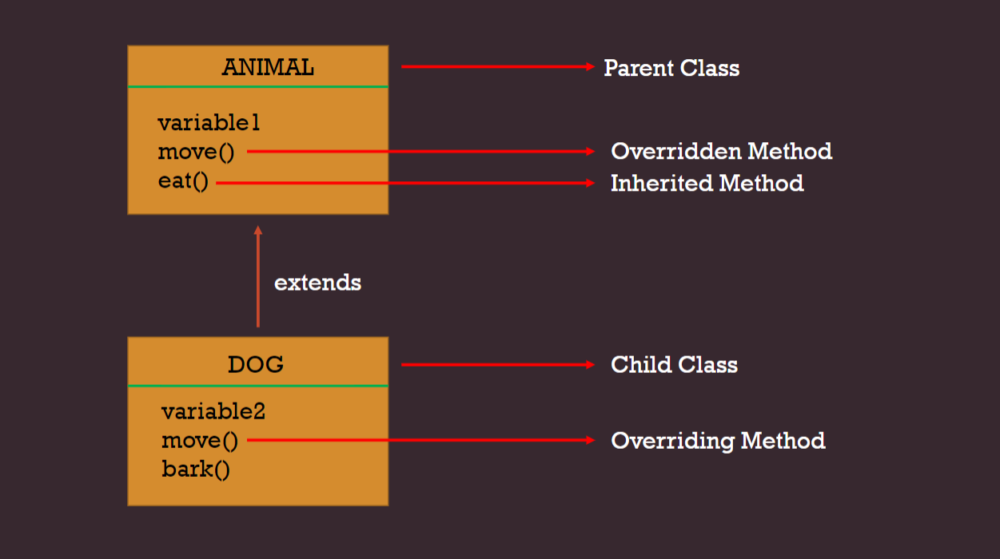
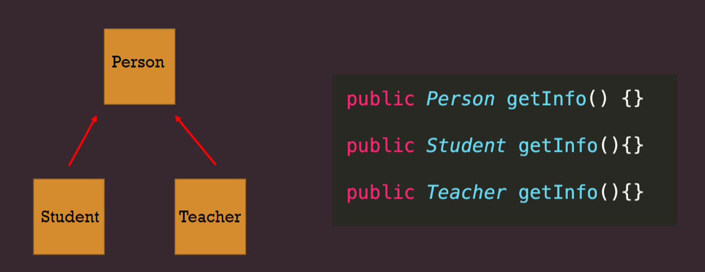
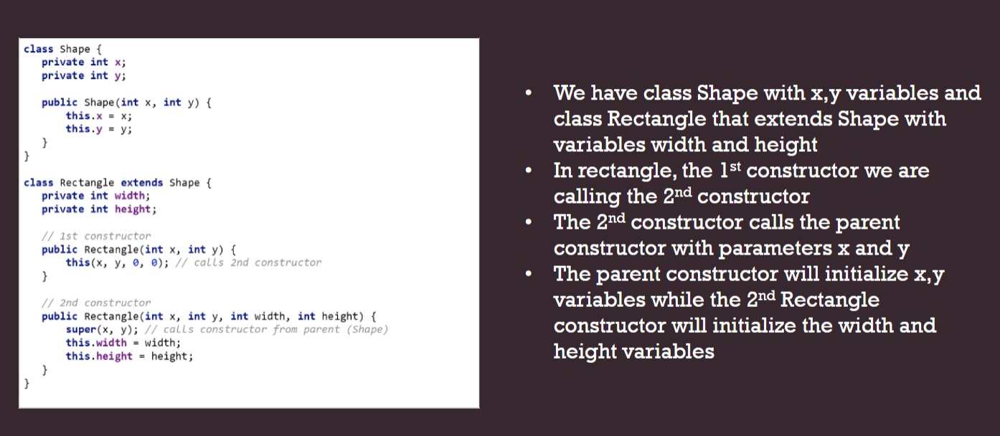

## < Static Member’s Inheritance >

    *  Static members from a super class are inherited as long asaccess modifier allows it.
    * Static variables are shared class variables, it will have single central value for all objects and sub classes.
    * Static methods, can be called either using ParentClass.methodNameor SubClass.methodName

## < Overriding Superclass Methods >

* Sometimes a subclass inherits a method from its superclass, 
but the method is inadequate for the subclass’s purpose. 
Because the subclass is more specialized than the superclass, 
it is sometimes necessary for the subclass to replace inadequate 
superclass methods with more suitable ones. 
This is know overriding.
  

##< Method Overriding Rules >

    1.There must be  is-a relationship(inheritance)
    2.The method must have the same name as in the parent class
    3.The method must have the same parameter as in the parent class
    4.Access modifier: Needs to be same or more visible

        public  -> public
        protected -> protected, public
        default -> default, protected, public

    5.Return type:•must be same or •covariant type (same class type or sub class type)

___________________________________________________________

##  Method Overloading

    Method overloading is performed within class
    In case of method overloading, parameter must be different
    Access specifier can be changed
    private and final methods can be overloaded
    Return type of method does not matter in case of method overloading, it can be same or different

## Method Overriding

    Method overriding occurs in two classes that have IS-A relationship
    In case of method overriding, parameter must be same
    Access specifier must not be more restrictive than original method
    private and final methods can not be overridden
    Return type must be same or covariant in method overriding

##Super Keyword in Java
The super keyword in java is a reference variable that is used to refer parent class objects. 
The keyword “super” is used with the concept of inheritance.

    * Super with variables (super.variable)
    * Super with methods (super.method)
    * Super with constructors (super() )

## this vs super
    * 1. The keyword super is used to access/call the parent class members (variables and methods)
         The keyword this  is used to call       the current class members (variables and methods). 
    * 2.This is required when we have a parameter with the same name as an instance variable•
    * 3.We can use both of them anywhere in a class except static areas (static block or static method)

##this() vs super()
    * this() is used to call a constructor from another overloaded constructor in the same class.
    * this() can be used only in a constructor, and it must be the first statement in a constructor. It is used with constructor chaining, in other words when one constructor calls another constructor.
    * The only way to call a parent constructor is by calling super(). This calls the parent constructor.

